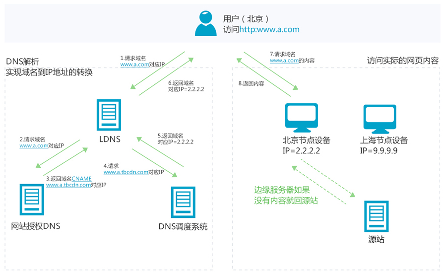

# 个人模块开发（二）

> **Organization**: 千锋教育 Python 教学部<br>
> **Date**: 2018-11-20<br>
> **Author**: [张旭](mailto:zhangxu@1000phone.com)


## 一、RESTful 与 前后端分离

1. RESTful
    - RESTful 是一种网络软件架构风格, 而非标准
    - 用 URL 定位一个网络资源
    - 用 HTTP 动词描述对资源的操作
        - GET: 用来获取资源
        - POST: 用来新建资源
        - PUT: 用来更新资源
        - DELETE: 用来删除资源
    - 误区
        - URL 中使用动词
        - URL 中出现版本号
        - 参数用 querystring 表示, 而不要拼在 path 部分
            - 错误示范: GET /user/book/id/3
            - 正确示范: GET /user/book?id=3
        - 状态码的使用要精确
            - 2xx：操作成功
            - 3xx：重定向
            - 4xx：客户端错误
            - 5xx：服务器错误
    - RESTful 与 Django REST framework 的区别

2. 前后端分离

    

    传统 Web 开发, view 函数中需要进行模版渲染, 逻辑处理与显示的样式均需要后端开发.

    变成前后端分离后, 显示效果的处理完全交给前端来做, 前端自由度变大. 后端只需要传递前端需要的数据即可, 将后端人员从繁琐的显示处理中解放出来, 专心处理业务逻辑

    - 优点: 前端负责显示, 后端负责逻辑, 分工更加明确, 彻底解放前、后端开发者
    - JSON: 完全独立于编程语言的文本格式, 用来存储和表示数据
    - 前后端分离后的开发流程

      

3. 代码实现

    ```python
    from json import dumps

    from django.http import HttpResponse

    def render_json(data=None, error_code=0):
        '''将返回值渲染为 JSON 数据'''
        result = {
            'data': data,       # 返回给前端的数据
            'code': error_code  # 状态码 (status code)
        }

        json_str = dumps(result, ensure_ascii=False, separators=[',', ':'])
        return HttpResponse(json_str)
    ```

4. 接口的定义

    1. 定义接口基本格式

       ```json
       {
           "code": 0,   // 状态码 (status code)
           "data": {    // 接口数据
               "user": {
                   "uid": 123321,
                   "username": "Lion",
                   "age": 21,
                   "sex": "Male"
                },
               "date": "2018-09-12",
           }
       }
       ```

    2. 定义 status 状态码

        code | description
        -----|-------------
        0    | 正常
        1000 | 服务器内部错误
        1001 | 参数错误
        1002 | 数据错误

    3. 详细定义每一个接口的各个部分:
        - 名称 (Name)
        - 描述 (Description)
        - 方法 (Method)
        - 路径 (Path)
        - 参数 (Params)
        - 返回值 (Returns)

    4. 接口定义举例：

        > **接口名称：提交验证码登录**
        >
        > * **Description**: 根据上一步的结果提交需要的数据
        > * **Method**: POST
        > * **Path**: /user/login
        > * **Params**:
        >
        >    field | required | type | description
        >    ------|----------|------|-----------------------
        >    phone | Yes      |  int | 手机号
        >     code | Yes      |  int | 验证码
        >
        > * **Return**:
        >
        >    field     | required | type | description
        >    ----------|----------|------|-----------------------
        >     uid      |    Yes   | int  | 用户 id
        >     nickname |    Yes   | str  | 用户名
        >     age      |    Yes   | int  | 年龄
        >     sex      |    Yes   | str  | 性别
        >     location |    Yes   | str  | 常居地
        >     avatars  |    Yes   | list | 头像 URL 列表, 最多为 6 张
        >
        >    示例:
        >    ```json
        >    {
        >        "code": 0,
        >        "data": {
        >            "uid": 123,                             // 用户 id
        >            "nickname": "Miao",                     // 用户名
        >            "age": 21,                              // 年龄
        >            "sex": "M",                             // 性别
        >            "location": "China/Beijing",            // 常居地
        >            "avatars": "http://xxx.com/icon/1.jpg"  // 头像
        >        },
        >    }
        >    ```


## 二、状态码及异常处理

1. 为什么要定义错误码
    * 使用错误码可以将错误分类, 调试时更容易甄别错误
    * 前后端通过错误码识别错误, 使接口更简单
    * 前端处理多语言时, 可以使用错误码匹配不同语言的提示信息

2. 逻辑异常类的实现

    ```python
    class LogicError(BaseException):
        '''程序内部逻辑错误'''
        code = None

        def __init__(self, data=None):
            self.data = data  # 发生异常时需要传回前端的数据

        def __str__(self):
            return self.__class__.__name__

    def gen_error(name: str, err_code: int) -> LogicError:
        '''逻辑异常类的工厂函数'''
        base_cls = (LogicError,)
        cls_attr = {'code': err_code}
        return type(name, base_cls, cls_attr)

    # 定义逻辑异常
    InternalError = gen_error('InternalError', 1000)  # 服务器内部错误
    LoginRequired = gen_error('LoginRequired', 2000)  # 用户未登录
    ```

3. 逻辑异常处理中间件

    ```python
    from django.utils.deprecation import MiddlewareMixin

    from common import errors
    from lib.http import render_json

    class ErrorHandlerMiddleware(MiddlewareMixin):
        '''将结果渲染成 json 数据'''
        def process_exception(self, request, exception):
            '''异常处理'''
            if isinstance(exception, errors.LogicError):
                # 处理逻辑错误
                return render_json(error=exception)
            else:
                # 处理程序错误
                error_info = format_exception(*exc_info())
                err_log.error(''.join(error_info))  # 将异常信息输出到错误日志
                return render_json(error=errors.InternalError)  # 程序错误统一使用 InternalError
    ```


## 三、Cookie、 Session 机制剖析

1. 产生过程
    1. 浏览器: 向服务器发送请求
    2. 服务器: 接受并创建 session 对象 (该对象包含一个 session_id)
    3. 服务器: 执行 views 函数, 并得到一个 response 对象
    4. 服务器: 执行 response.set_cookie('sessionid', session_id) 将 session_id 写入 cookie
    5. 服务器: 将 response 传回浏览器
    6. 浏览器: 读取 response 报文, 从 Cookies 取出 session_id 并保存

2. 后续请求
    1. 浏览器: 向服务器发送请求, session_id 随 Cookies 一同发给 Server
    2. 服务器: 从 Headers 的 Cookies 中取出 session_id
    3. 服务器: 根据 session_id 找出对应的数据, 确认客户端身份

3. Django 中的代码实现

    ```python
    class SessionMiddleware(MiddlewareMixin):
        def __init__(self, get_response=None):
            self.get_response = get_response
            engine = import_module(settings.SESSION_ENGINE)
            self.SessionStore = engine.SessionStore  # 设置 Session 存储类

        def process_request(self, request):
            # 从 Cookie 获取 sessionid
            session_key = request.COOKIES.get('session_id')

            # 通过 session_key 获取之前保存的数据
            request.session = self.SessionStore(session_key)

        def process_response(self, request, response):
            try:
                # View 函数结束后, 获取 session 状态
                accessed = request.session.accessed
                modified = request.session.modified
                empty = request.session.is_empty()
            except AttributeError:
                pass
            else:
                # 如果 Cookie 中有 sessionid, 但 session 为空,
                # 说明 view 中执行过 session.flush 等操作,
                # 直接删除 Cookie 中的 session
                if 'session_id' in request.COOKIES and empty:
                    response.delete_cookie(
                        settings.SESSION_COOKIE_NAME,
                        path=settings.SESSION_COOKIE_PATH,
                        domain=settings.SESSION_COOKIE_DOMAIN,
                    )
                else:
                    if accessed:
                        patch_vary_headers(response, ('Cookie',))
                    if (modified or settings.SESSION_SAVE_EVERY_REQUEST) and not empty:
                        # 设置过期时间
                        if request.session.get_expire_at_browser_close():
                            max_age = None
                            expires = None
                        else:
                            max_age = request.session.get_expiry_age()
                            expires_time = time.time() + max_age
                            expires = cookie_date(expires_time)

                        # 保存会话数据, 并刷新客户端 Cookie
                        if response.status_code != 500:
                            try:
                                request.session.save()
                            except UpdateError:
                                raise SuspiciousOperation(
                                    "The request's session was deleted before the "
                                    "request completed. The user may have logged "
                                    "out in a concurrent request, for example."
                                )

                            # 让客户端将 sessionid 添加到 Cookie 中
                            response.set_cookie(
                                'session_id',
                                request.session.session_key,
                                max_age=max_age,
                                expires=expires,
                                domain=settings.SESSION_COOKIE_DOMAIN,
                                path=settings.SESSION_COOKIE_PATH,
                                secure=settings.SESSION_COOKIE_SECURE or None,
                                httponly=settings.SESSION_COOKIE_HTTPONLY or None,
                            )
            return response
    ```


## 四、Django 中的 Form 表单验证

- 核心功能：数据验证

- form 的 method 只能是 POST 或 GET

- method=GET 时, 表单提交的参数会出现在 URL 里

- 属性和方法
    - `form.is_valid()`
    - `form.has_changed()`
    - `form.clean_<field>()`
    - `form.cleaned_data['fieldname']`

- Form 的定义和使用

    ```python
    from django.forms import Form
    from django.forms import IntegerField, CharField, DateField, ChoiceField

    class TestForm(Form):
        TAGS = (
            ('py', 'python'),
            ('ln', 'linux'),
            ('dj', 'django'),
        )
        fid = IntegerField()
        name = CharField(max_length=10)
        tag = ChoiceField(choices=TAGS)
        date = DateField()

    data = {'fid': 'abc123', 'name': '1234567890', 'tag': 'dj', 'date': '2017-12-17'}
    form = TestForm(data)
    print(form.is_valid())
    print(form.cleaned_data)  # cleaned_data 属性是 is_valid 函数执行时动态添加的
    print(form.errors)
    ```

- ModelForm

    ```python
    class UserForm(ModelForm):
        class Meta:
            model = User
            fields = ['name', 'birth']
    ```


## 五、项目中的静态文件处理

1. Nginx

    Nginx 处理静态资源速度非常快, 并且自身还带有缓存.

    但需要注意, 分布式部署的多台 Nginx 服务器上, 静态资源需要互相同步

2. CDN

    

    CDN 的全称是 Content Delivery Network, 即内容分发网络.

    它依靠部署在各地的边缘服务器, 通过中心平台的负载均衡、内容分发、调度等功能模块, 使用户就近获取所需内容, 降低网络拥塞, 提高用户访问响应速度和命中率. CDN 的关键技术主要有内容存储和分发技术.

3. 云存储

    - 常见的云存储有：亚马逊 S3 服务、阿里云的 OSS 、七牛云 等

4. 七牛云接入

    1. 注册七牛云账号

    2. 创建存储空间

    3. 获取相关配置
        - AccessKey
        - SecretKey
        - Bucket_name
        - Bucket_URL

    4. 安装 qiniu SDK：`pip install qiniu`

    5. [根据接口文档进行接口封装](https://developer.qiniu.com/kodo/sdk/1242/python)

    6. 按照需要将上传、下载接口封装成异步任务

    7. 程序处理流程

        1. 用户图片上传服务器
        2. 服务器将图片上传到七牛云
        3. 将七牛云返回的图片 URL 存入数据库
